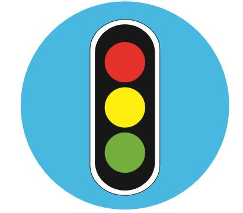
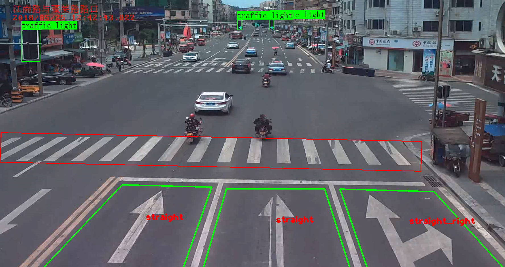
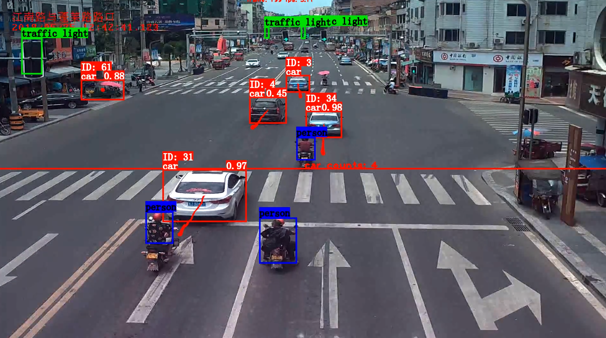

<p align="center">
  
</p>

<h1 align="center">Intelligent Transportation System</h1>

<p align="center">
    <a href="https://github.com/Sh-Zh-7/intelligent-transportation-system/issues" style="text-decoration:none" >
        
    </a>
    <a href="https://github.com/Sh-Zh-7/ntelligent-transportation-system" style="text-decoration:none" >
        
    </a>
  <a href="https://github.com/Sh-Zh-7/intelligent-transportation-system/blob/master/LICENSE" style="text-decoration:none">
        
    </a>
</p>

</br>

# Background

With the AI entering the national strategic level agenda and the continuous innovation and breakthrough of AI technology, intelligent transportation system will become an inevitable development trend in the future. To realize the intuitive understanding and convenient means of transportation system, a large number of transportation information must be processed by using computer vision technology. In the application of this technology, it not only reduces the traffic congestion, realizes the smooth traffic during the transportation, but also reduces a large number of traffic accidents, and strengthens the traffic supervision and safety.

# Preview

Many users may find it too hard to deploy our project while we did not put it on the cloud instance for economic reasons. However, you can still see the effect by watching our  well prepared videos.

**BiliBili**: [https://www.bilibili.com/video/BV1R5411Y7yL/](https://www.bilibili.com/video/BV1R5411Y7yL/)

**Youtube**: [https://youtu.be/d30V_p2JPyM](https://youtu.be/d30V_p2JPyM)

# Prerequisites

This is a program that **ONLY** runs on the **Ubuntu** server side(There is no need to deploy our project in different platform like MacOS or Windows). We strongly recommend using GPU rather that CPU to deal with your video(although the speed that CPU deal with the image is fast enough, the video require dealing with more images, which called frames). For GPU configuration please see below(Otherwise it is not compatible with the tensorflow version):

- **CUDA 10.0:** https://developer.nvidia.com/cuda-toolkit-archive (on Linux do [Post-installation Actions](https://docs.nvidia.com/cuda/cuda-installation-guide-linux/index.html#post-installation-actions))
- **cuDNN >= 7.0 for CUDA 10.0** https://developer.nvidia.com/rdp/cudnn-archive (on **Linux** copy `cudnn.h`,`libcudnn.so`... as desribed here https://docs.nvidia.com/deeplearning/sdk/cudnn-install/index.html#installlinux-tar , on **Windows** copy `cudnn.h`,`cudnn64_7.dll`, `cudnn64_7.lib` as desribed here https://docs.nvidia.com/deeplearning/sdk/cudnn-install/index.html#installwindows )
- **GPU with CC >= 3.0**: https://en.wikipedia.org/wiki/CUDA#GPUs_supported

# Installation

- Clone this repo by entering `git clone git@github.com:Sh-Zh-7/intelligent-transportation-system.git`
- Download our pretrained model:
  - **yolo v4** on MS COCO dataset([[Google](https://drive.google.com/file/d/1eHZahK3nOQSJPveFVUKIQXZflt1Tf0ig/view?usp=sharing)]\[[Baidu](https://pan.baidu.com/s/1yHq0TX3dj80WSTljup1MtA), code: 4dm4]). Put it in `./model/Detection/keras_yolov4/model_data/` directory.
  - **MobileNet** as encoder and **SegNet** as decoder on zebra crossing images download on the Internet([[Google](https://drive.google.com/file/d/10wvSYLTB39wKp3rSmBbfHPd93aVOjcJE/view?usp=sharing)]\[[Baidu](https://pan.baidu.com/s/19S4A1GnlzONcLxXsji-lzg), code: yv6c]). Put it in `./model/Segmentation/segnet_mobile/` directory.
  - Other models, such as **DeepSort**'s weight, due to their  small sizes(not exceed Github's regular file's size), are already put in our repo.

# Dependency

- The model is mainly written by python, so you have to install the packages in requirements.txt. Before that, you'd better start a virtual environment by using conda.

```shell
cd ITS		# Enter the project's root directory
conda create -n {env_name}	# Make an env_name by yourself
conda activate {env_name}
chmod 777 build_linux.sh
source build_linux.sh	# Install all dependencies of python
```

- Then you need to install node.js dependencies to ensure that you can run the serve.

```shell
# BTW, you have to install node and npm in your OS at first!
npm install --dependencies
npm run start
```

- After all those procedure, you finally start a node serve. Try type `localhost:8080/` to see the result. Last but not least, don't forget to quit the virtual environment at last.

```shell
conda deactivate
```

# Basic jobs

## Taffic light & zebra crossing & lane & lane mark

For those jobs, we require user to input static background image of the video, so we can get the environment’s information.

We use **object detection** and **semantic segmentation** method to get the position of traffic light and zebra crossing.

As for the lane and lane mark, we choose to use **traditional cv** method, including connected domain, contour detection, flood fill and similarity calculation, .etc.



## Car tracking & LPR & pedestrians detection

After get the environment information about the videos, we can do further jobs that require time context information of the video.

Before this, we get the position of the traffic light, and when dealing with video, we can **convert the traffic light roi into hsv color space** to get the current color.

And the pedestrians detection is based on newly come up model: **yolo v4**(2020 May). As for the car tracking, we introduce the deep sort algorithm, which is a **tracking model** based on object detecion, so we can reduce our project’s size.



# Combination jobs

1. **Does the vehicle cross the line?** Judge whether the center point is higher than the lane line
2. **Does the vehicle not wait for person?** Judge whether the car and person are on the crossing line at the same time.
3. **Does the vehicle run the red light?** Judge whether the car is moving forward the the traffic light's color is red.
4. **Does the vehicle drive without guidance?** Judge whether the car's moving direction is the same as its origin lane.

You can see above that our implementation is very simple. That is because the real condition is in 3D world. But we don't have the camera's intrinsic or extrinsic matrix. So we have to judge all these conditons in 2D. So the implementation won't be too complex.

# How to use

Firstly I strongly recommend using this model through command line and python script only, though we still provide a web page for you. However, the backend only starts a child process to execute the python script, so it is not stable enough in some situations. **Remember, model is the core component of this repository.**

</br>

If you still want to start a web server, you can follow these steps:

set relative paths in Controller/index.js

```shell
cd Controller
npm install
npm run start
```

then you can visit https://127.0.0.1:8000 in browser to see this demo.

